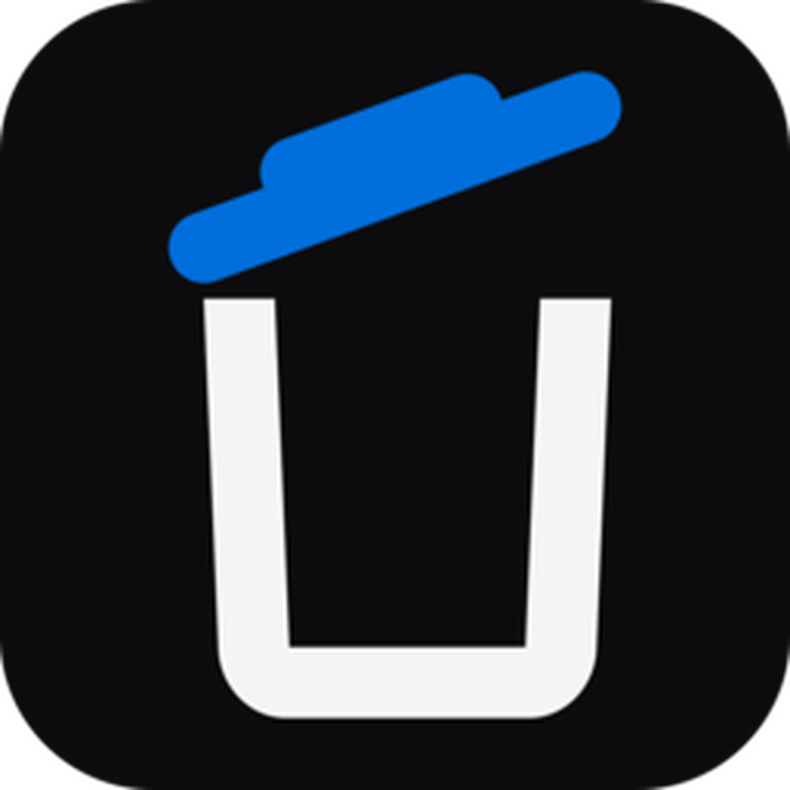

<div align="center">
  

# _davUNINSTALL

**Disinstalla applicazioni e ripulisci i residui con controlli di sicurezza.**  
**Uninstall applications and clean leftovers with safety checks.**

Windows-first · Local-first · Open source

[](#-italiano)
[](#-english)
</div>

---

# 🇮🇹 Italiano

_davUNINSTALL è un'app desktop di **_davstudios** pensata per disinstallare programmi su Windows e analizzare in modo prudente i residui rimasti dopo la rimozione. Il rilevamento, le scansioni, i backup e le verifiche vengono eseguiti localmente sul computer.

<p>
  <a href="https://www.davstudios.it"></a>
  <a href="https://buymeacoffee.com/davstudios"></a>
</p>

## Funzioni principali

- elenco delle applicazioni installate con ricerca, versione, produttore e percorso;
- avvio del disinstallatore registrato su Windows, con gestione di percorsi quotati, variabili d'ambiente e richiesta UAC quando necessaria;
- tre livelli di controllo: **Basso**, **Medio** e **Alto**;
- scansione profonda post-disinstallazione di file, cartelle, chiavi e valori del Registro;
- scansione forzata per programmi già rimossi dall'elenco delle applicazioni installate;
- selezione manuale dei residui sicuri in modalità Media;
- automazione in modalità Alta con doppia conferma e rimozione dei soli candidati `Exact` / `High confidence` rivalidati;
- backup `.reg` e manifest locale prima delle modifiche al Registro;
- rivalidazione immediatamente prima della rimozione e verifica dopo la pulizia;
- utilizzo del Cestino per file e cartelle Windows quando possibile;
- pulizia prudente della cartella TEMP dell'utente con soglia 7/14/30 giorni;
- esclusione di symlink e reparse point dalle operazioni distruttive;
- interfaccia italiana e inglese con tema Sistema, Chiaro e Scuro.

## Modalità di eliminazione

**Basso** avvia soltanto il disinstallatore ufficiale registrato e non esegue scansioni automatiche.

**Medio** avvia il disinstallatore e lascia all'utente la scansione e la selezione manuale dei residui.

**Alto** richiede due conferme, attende la conclusione reale del disinstallatore, esegue una scansione profonda e rimuove automaticamente soltanto elementi Exact/High rivalidati. Elementi condivisi, deboli o ambigui restano esclusi.

## Sicurezza

_davUNINSTALL non elimina un elemento basandosi su una semplice somiglianza del nome. Il backend costruisce una whitelist dei candidati, la rivalida al momento della pulizia e ignora ID che non appartengono più alla scansione corrente. Le chiavi del Registro vengono esportate prima della modifica e le operazioni elevate vengono eseguite soltanto quando necessarie.

La pulizia TEMP è limitata alla cartella temporanea dell'utente su Windows. Le directory vengono valutate in modo conservativo e link simbolici/reparse point sono esclusi.

## Privacy e local-first

- nessun account;
- nessun invio dell'elenco programmi;
- nessun upload di percorsi o chiavi del Registro;
- nessuna elaborazione cloud;
- nessuna telemetria integrata.

Le informazioni analizzate restano sul dispositivo.

## Piattaforme

| Sistema | Supporto |
| --- | --- |
| Windows 10/11 x64 | Flusso completo: rilevamento, disinstallazione, residui, Registro, modalità Alta e TEMP |
| macOS | Rilevamento `.app` e analisi conservativa; rimozione profonda automatica non abilitata |
| Linux | Rilevamento `dpkg` / Flatpak e analisi conservativa; rimozione profonda automatica non abilitata |

Le operazioni distruttive avanzate restano intenzionalmente Windows-first finché non sono validate con lo stesso livello di sicurezza sulle altre piattaforme.

## Installazione di release non firmate

Le build pubbliche non utilizzano attualmente un certificato commerciale Windows né Apple Developer ID/notarizzazione. Scarica sempre gli artefatti dalla repository GitHub ufficiale di `_davstudios`.

### Windows

SmartScreen può mostrare **Windows ha protetto il PC**. Se il file proviene dalla repository ufficiale, scegli **Ulteriori informazioni → Esegui comunque**. La build Release usa il sottosistema GUI di Windows e non apre una console CMD separata per `_davUNINSTALL`; anche gli helper tecnici interni Windows vengono avviati senza finestre console. Il disinstallatore reale di un programma può invece mostrare la propria interfaccia, UAC o finestra quando previsto dal software stesso.

### macOS

Se Gatekeeper blocca la prima apertura, prova ad aprire l'app e poi vai in **Impostazioni di Sistema → Privacy e Sicurezza → Apri comunque**.

### Linux

Per un'AppImage può essere necessario renderla eseguibile:

```bash
chmod +x _davUNINSTALL*.AppImage
```

## Sviluppo

Requisiti: Node.js, Rust e prerequisiti Tauri del sistema operativo.

```bash
npm install
npm run desktop
```

Test:

```bash
npm test
```

Build locale:

```bash
npm run bundle
```

Gli artefatti vengono generati in `src-tauri/target/release/bundle/`.

## Stack e identità

- Tauri 2;
- Rust;
- JavaScript + Vite;
- Plus Jakarta Sans;
- motion system coerente con il sito `_davstudios`;
- bundle identifier stabile: `studio.dav.uninstall`;
- licenza MIT.

La versione dell'app è gestita nei manifest tecnici e nelle GitHub Release; non viene mostrata nell'interfaccia ordinaria per mantenere la UI pulita e impedire stringhe di versione duplicate.

## Licenza

Distribuito con licenza **MIT**. Consulta [`LICENSE`](LICENSE).

---

# 🇺🇸 English

_davUNINSTALL is a desktop app by **_davstudios** designed to uninstall programs on Windows and cautiously analyze leftovers after removal. Detection, scans, backups and verification are performed locally on the computer.

<p>
  <a href="https://www.davstudios.it/en"></a>
  <a href="https://buymeacoffee.com/davstudios"></a>
</p>

## Main features

- installed-application list with search, version, publisher and location;
- launch of the registered Windows uninstaller, including quoted paths, environment variables and UAC when required;
- three removal-control levels: **Low**, **Medium** and **High**;
- deep post-uninstall scan of files, folders, Registry keys and values;
- forced scan for programs already absent from the installed-app list;
- manual selection of safe leftovers in Medium mode;
- High-mode automation with double confirmation and automatic removal of revalidated `Exact` / `High confidence` candidates only;
- `.reg` backups and a local operation manifest before Registry changes;
- revalidation immediately before removal and verification after cleanup;
- Recycle Bin removal for Windows files and folders when possible;
- cautious user TEMP cleanup with 7/14/30-day thresholds;
- symlink and reparse-point exclusion from destructive operations;
- Italian and English interface with System, Light and Dark themes.

## Removal modes

**Low** only starts the registered official uninstaller and performs no automatic scan.

**Medium** starts the uninstaller and leaves residual scanning and manual selection to the user.

**High** requires two confirmations, waits for the real uninstaller to finish, runs a deep scan and automatically removes only revalidated Exact/High items. Shared, weak or ambiguous candidates remain excluded.

## Safety

_davUNINSTALL never treats a simple name similarity as sufficient reason to delete an item. The backend builds a candidate whitelist, revalidates it at cleanup time and ignores IDs that no longer belong to the current scan. Registry keys are exported before modification and elevated operations run only when necessary.

TEMP cleanup is limited to the Windows user temporary directory. Directories are evaluated conservatively and symbolic links/reparse points are excluded.

## Privacy and local-first

- no account;
- no installed-app list upload;
- no upload of paths or Registry keys;
- no cloud processing;
- no built-in telemetry.

Analyzed information remains on the device.

## Platforms

| System | Support |
| --- | --- |
| Windows 10/11 x64 | Full flow: detection, uninstall, leftovers, Registry, High mode and TEMP |
| macOS | `.app` detection and conservative analysis; automatic deep removal is not enabled |
| Linux | `dpkg` / Flatpak detection and conservative analysis; automatic deep removal is not enabled |

Advanced destructive operations intentionally remain Windows-first until they can be validated with the same safety level on the other platforms.

## Installing unsigned releases

Public builds currently do not use a commercial Windows signing certificate or Apple Developer ID/notarization. Always download artifacts from the official `_davstudios` GitHub repository.

### Windows

SmartScreen may display **Windows protected your PC**. If the file comes from the official repository, choose **More info → Run anyway**. Release builds use the Windows GUI subsystem, so `_davUNINSTALL` does not open a separate CMD console; internal Windows helper processes also run without console windows. A program's real uninstaller may still show its own interface, UAC prompt or window when that software requires it.

### macOS

If Gatekeeper blocks the first launch, attempt to open the app and then go to **System Settings → Privacy & Security → Open Anyway**.

### Linux

An AppImage may need executable permission:

```bash
chmod +x _davUNINSTALL*.AppImage
```

## Development

Requirements: Node.js, Rust and the Tauri prerequisites for your operating system.

```bash
npm install
npm run desktop
```

Tests:

```bash
npm test
```

Local build:

```bash
npm run bundle
```

Artifacts are generated in `src-tauri/target/release/bundle/`.

## Stack and identity

- Tauri 2;
- Rust;
- JavaScript + Vite;
- Plus Jakarta Sans;
- motion system aligned with the `_davstudios` website;
- stable bundle identifier: `studio.dav.uninstall`;
- MIT License.

The app version is managed in technical manifests and GitHub Releases; it is intentionally not displayed in the ordinary interface to keep the UI clean and avoid duplicated version strings.

## License

Distributed under the **MIT License**. See [`LICENSE`](LICENSE).
